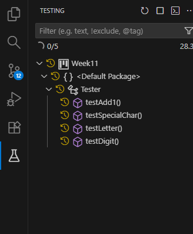
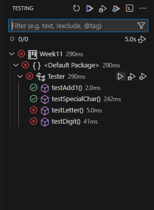
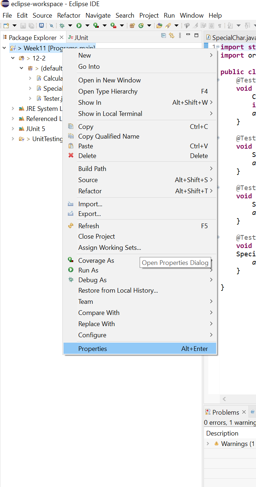
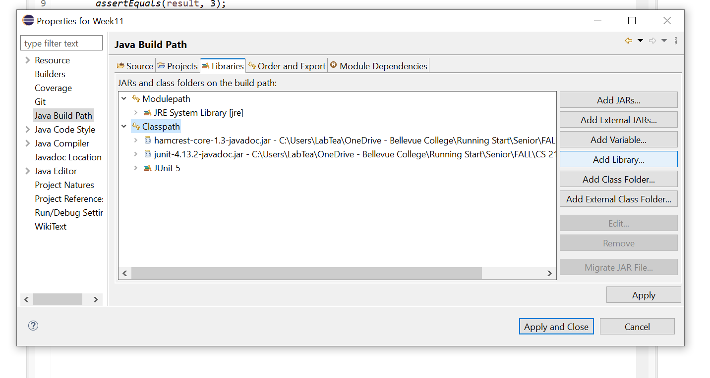
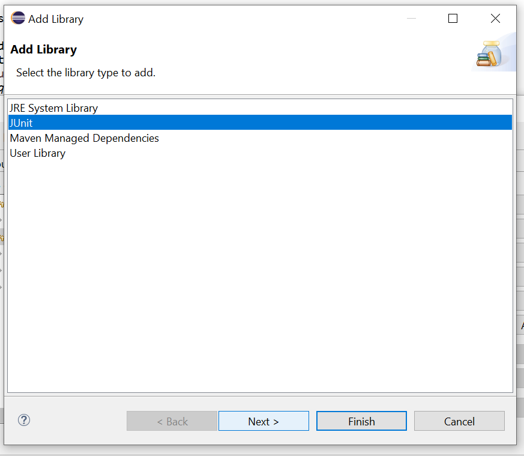
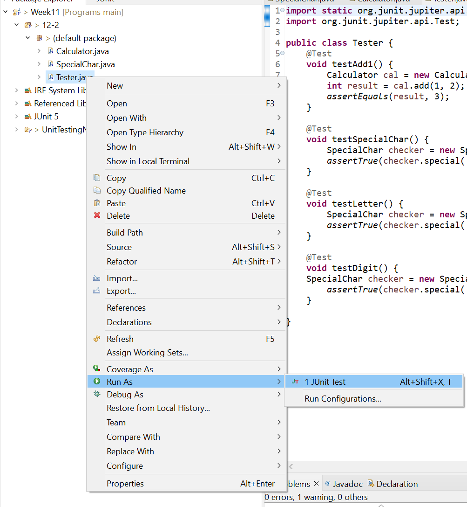
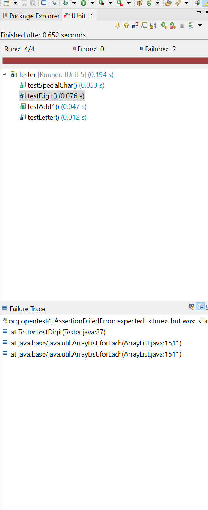

# Unit Testing (2 Questions on Exam)

* Code coverage and checking if my code works or not.
* Simple testing on a specific unit such as a method.

* Examples in database and needing to test for exceptions and edge cases.

## Getting Set-up

Links

* [JUnit 4 Starting Page](https://junit.org/junit4/)
* [JUnit 4 JAR Downloads](https://github.com/junit-team/junit4/wiki/Download-and-Install)
  * [JUnit 4.13.2](https://repo1.maven.org/maven2/junit/junit/4.13.2/)
  * [Hamcrest Core 1.3](https://repo1.maven.org/maven2/org/hamcrest/hamcrest-core/1.3/)
* [JUnit Framework Source](https://github.com/junit-team/junit-framework)

### VS Code

* Create a Java Project through `Ctrl+Shift+P` which should open the command palette on the top of your screen with `> type here` where you can type java and use the create java project option.
* Download the java testing extensions from <https://code.visualstudio.com/docs/java/java-testing>.
* You should see a standard conical flask on the sidebar where you can do testing.



* Running the tests



### Eclipse IDE

* Simply create a project and your program and testing files.
* On the folder, right click and go to properties.



* In properties, go to libraries and import the JUnit library. 



* Follow the steps and Apply & Close.



* Now in your testing, use these imports:

```java
import static org.junit.jupiter.api.Assertions.*; // static is shortcut instead of doing Assertitions.assertEquals(), you can just do assertEquals().
import org.junit.jupiter.api.Test;
```

* Now use these annotations and create your own unit tests and main programs.

```java
@Test
void test1{
    // your setup code
    // your assertion from junit.
}
```

* Finally, to run the unit test, right click on the file and hover over run-as and finally there should be an option for Junit-Test. You can also try the `Alt+Shift+X T` shortcut.



* Woohoo (ok my tests didn't pass)



# Main Testing & Assertions

* We use assertions to test.

* Usually in the form `assert boolean_expression : boolean_expression;`

* Use JUnit with assertions such as `assertEquals`.

### Program

```java
public class Calculator {
      public int add(int a, int b){
        return a + b;
    }

    public int subtract(int a, int b){
        return a - b;
    }
}
```

### Testing

```java
public class Testing {
    @Test //Must be capital @Test for JUnit to recognize it.
    void testAdd1() {
        Calculator cal = new Calculator();
        int result = cal.add(1,2);
        assertEquals(result, 3);
    }

    public static void main(String[] args){

    }
}
```

# Assertitions Methods

| Assertion | Purpose | Example |
|-----------|---------|---------|
| `assertEquals(expected, actual)` | Values are equal | `assertEquals(5, add(2,3));` |
| `assertNotEquals(unexpected, actual)` | Values are not equal | `assertNotEquals(0, divide(10,2));` |
| `assertTrue(condition)` | Condition is true | `assertTrue(list.isEmpty());` |
| `assertFalse(condition)` | Condition is false | `assertFalse(value < 0);` |
| `assertNull(actual)` | Value is null | `assertNull(obj.getChild());` |
| `assertNotNull(actual)` | Value is not null | `assertNotNull(service);` |
| `assertSame(expected, actual)` | Both references point to same object | `assertSame(a, b);` |
| `assertNotSame(unexpected, actual)` | References point to different objects | `assertNotSame(a, b);` |
| `assertArrayEquals(expected, actual)` | Arrays contain same elements | `assertArrayEquals(new int[]{1,2}, arr);` |
| `assertIterableEquals(expected, actual)` | Iterables have equal elements | `assertIterableEquals(list1, list2);` |
| `assertLinesMatch(expected, actual)` | Line-by-line pattern match | `assertLinesMatch(expectedLines, actualLines);` |
| `assertThrows(Exception.class, executable)` | Code throws expected exception | `assertThrows(IllegalArg.class, () -> foo(null));` |
| `assertDoesNotThrow(executable)` | Code runs without exceptions | `assertDoesNotThrow(() -> runTask());` |
| `fail(message)` | Force test failure | `fail("Should not reach this");` |
